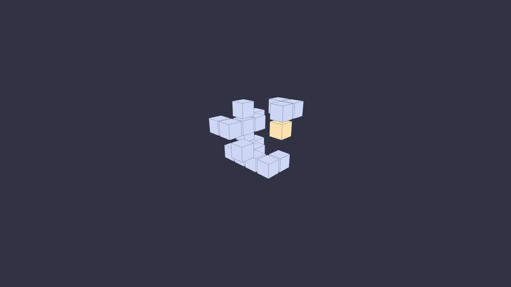

# 🧊 cubes – a catppuccin-themed wallpaper pack

A minimalist wallpaper pack featuring **procedurally generated stacking cubes**, created using [p5.js](https://p5js.org/) and coloured with the beautiful [Catppuccin Mocha](https://github.com/catppuccin/catppuccin) palette.

Each wallpaper is rendered at **1920x1080** resolution in both **landscape** and **portrait** orientations -- for dual-monitor setups, desktops, or vertical displays.

  

_Sample: Catppuccin Mocha palette with isometric cube stack_

## What's Included

- `cubes-landscape/` – 1920x1080 horizontal wallpapers
- `cubes-portrait/` – 1080x1920 vertical wallpapers
- `.png` format

All images are generated using randomized seeds — no two are exactly alike.

- Built with [p5.js](https://p5js.org/)
- Catppuccin Mocha colour theme
- Grid-based procedural layout

## Inspiration

This project was inspired by isometric cube stacks, procedural design, and the calming tones of the Catppuccin theme.

## Source Code

If you'd like to generate your own variations, check out the `/sketch/` folder containing the original p5.js source files.

Or you can tweak and generate your own version with the p5.js web editor: <https://editor.p5js.org/thrly/sketches/JFO5uldxb>

---

## Want more?

I also made: 🧊 [cubes-wallpaper](https://github.com/thrly/cubes-wallpaper) – 3D stacking cube wallpapers with Catppuccin colourscheme

made with 🩵 and cats
